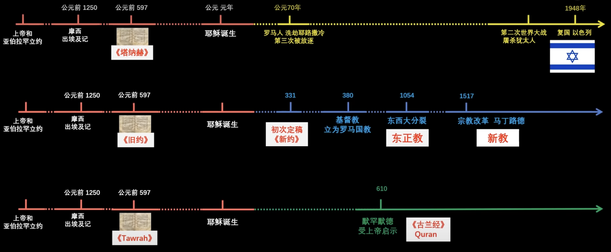

### 宗教

#### 现今主流宗教

1. 犹太教：全球犹太人数量约为1400万，但信仰程度不一，人数虽少但是历史很久。
2. 基督宗教（基督教）：大约有20亿基督徒，其中包括天主教(10亿-13亿)、东正教(260万-300万)和各种新教(9亿-10亿)派别。
3. 伊斯兰教：全球约有16亿穆斯林，主要分为逊尼派（85%-90%）和什叶派（10%-15%）。
4. 佛教：大约有5亿佛教徒，主要分布在东亚、南亚和东南亚地区。
5. 印度教：大约有10亿印度教徒，主要集中在印度。
6. 摩门教（耶稣基督后期圣徒教会）：全球信徒人数约为1500万。
7. 锡克教：大约有3000万锡克教徒，主要分布在印度和其他国家。
8. 卢修斯托教（非洲传统宗教）：信仰者众多，但确切数字较难确定。
9. 佛教教派：除了主要的佛教信仰外，还有一些小规模的佛教教派，如日本的新宗教。
10. 其他宗教：还有许多小规模的宗教信仰，如锡克教、巴哈伊信仰、道教、神道教等。

#### 宗教的现实意义

宗教信仰对个人和社会具有广泛的现实意义，这种意义可以从各个方面来解释，包括精神、道德、社会、文化和个人层面。

1. 精神层面：
   - 为生活赋予意义：宗教信仰可以帮助人们回答生活中的深刻问题，如生死、人生意义和宇宙的起源，为他们的生活赋予更深层次的意义和目的感。
   - 提供心灵安慰：在面临困难、悲伤和挑战时，宗教信仰可以提供安慰和希望，帮助人们处理情感和应对生活中的困难。

2. 道德层面：
   - 提供伦理指导：宗教通常包含一套道德准则和伦理原则，这些原则可以指导个人的行为，促使人们做出善良、正直和仁慈的选择。
   - 鼓励社会责任感：宗教信仰可以强调个体对社会的责任感，鼓励人们关心弱势群体、从事慈善活动和积极参与社区服务。

3. 社会层面：
   - 促进社会凝聚力：宗教信仰可以在社会中建立共同的价值观和认同感，有助于促进社会凝聚力，减少冲突和分裂。
   - 提供社交支持：宗教团体和教堂可以成为社交交往的场所，提供社交支持网络，帮助人们建立亲密的关系和友谊。

4. 文化层面：
   - 影响文化传统：宗教信仰在文化中扮演重要角色，塑造着文学、艺术、建筑和节日等方面的传统。
   - 传承价值观念：宗教信仰有助于传承代代相传的价值观念，维护文化认同和传统。

5. 个人层面：
   - 提供心灵成长：宗教实践如冥想、祷告和灵修可以帮助个体实现心灵成长，提高情感智慧和自我认识。
   - 促进健康和幸福：一些研究发现，宗教信仰与身心健康和幸福感之间存在一定的正相关。

需要指出的是，宗教信仰的意义在不同人群和文化中可能会有所不同，而且不是每个人都信仰宗教。尊重个人的信仰选择以及对多元宗教社会的包容性是实现社会和谐的重要因素。

#### 道德、宗教、法律

宗教和法律都在塑造人类的道德和价值观方面发挥着重要作用。它们可以互补，但也可能存在冲突。社会中的道德和价值观是多元的，受到宗教、法律、文化、教育和家庭等多种因素的影响。理解和尊重这些多元性是建立和谐社会的重要因素。

1. 宗教与道德：

   - 宗教在塑造道德和价值观方面起到重要作用。宗教信仰通常包括一套道德准则和伦理原则，它们指导信徒的行为，并强调善良、正直、仁慈等价值。这些宗教道德原则可以对个体行为和社会行为产生深远的影响。
   - 宗教提供了道德框架，可以回答一些根本性的伦理问题，如生与死、善与恶、公平与正义等。宗教教义通常有权威性，可以为信徒提供明确的指导。
   - 不同宗教可能有不同的道德准则，这导致了不同宗教信仰之间的道德差异。

2. 法律与道德：

   - 法律也是塑造社会道德的重要工具。法律制定了社会规则和行为标准，追求公平、正义和社会秩序。法律对于规范人们的行为和维护社会稳定至关重要。

   - 法律通常反映了社会的共同价值观，这些价值观可能受到宗教、哲学和文化的影响。因此，宗教和哲学道德观念有时会在法律中找到反映。

   - 法律可以强制执行，而宗教道德通常是自愿的。违反法律可能会导致法律制裁，而违反宗教道德可能会导致宗教社群内部的道德谴责或排斥。

3. 宗教与法律

   - 宗教和法律可以互补，因为它们都有助于维护社会秩序和规范人们的行为。宗教道德可以在某种程度上为法律提供道德基础，特别是在道德问题不明确或争议性的情况下。
   - 同时，宗教和法律也可能发生冲突。当宗教信仰与法律要求之间存在冲突时，法律通常会占主导地位，尤其是在涉及公共利益和个体权利之间需要权衡的情况下。

4. 社会角度

   - 道德、宗教信仰和法律都是社会建设的重要组成部分。社会的共同价值观和道德规范通常反映在法律中，同时也受到宗教信仰的塑造。这三者共同维护社会秩序、正义和道德标准。

5. 个体角度

   - 个体通常受到社会的道德和法律规则的约束，但他们的宗教信仰可以为他们提供道德指导。个体可能会根据宗教信仰做出道德决策，但也必须考虑法律的限制。这可能导致个体在道德和法律之间做出选择和权衡。

### 犹太教

#### 发展历程

犹太教是世界上最古老的宗教之一，其发展历程涵盖了几千年的历史。以下是犹太教的发展历程、重要事件和重要人物的概述：

1. **亚伯拉罕的约定（公元前2000年左右）**：犹太教的根源可以追溯到亚伯拉罕，他与上帝之间的约定被认为是犹太人民的起源。这一约定奠定了犹太教的信仰基础。

2. **出埃及记（公元前13世纪）**：摩西领导以色列人从埃及奴隶制度中解放出来，并在西奈山上接受了上帝的十诫。这些戒律成为了犹太教道德法律的核心。

3. **圣殿的建立（公元前10世纪）**：以色列国的国王所罗门建造了第一座圣殿，成为犹太教的宗教中心。之后，第一座圣殿在公元前6世纪被巴比伦人摧毁，成为历史上的一个重要事件。

4. **犹太散居（公元前6世纪至公元20世纪）**：犹太人民分散到世界各地，形成了犹太教的各个派别和文化传统。他们在各地保持着自己的宗教实践和文化。

5. **第二次圣殿的毁灭（公元70年）**：罗马军队摧毁了耶路撒冷的第二座圣殿，这导致了犹太人民的分散流散，被称为大犹太流散。

6. **犹太教法典的编纂（公元2至6世纪）**：犹太教的法律和宗教规则被整理成一套法典，包括《米什纳》、《塔木德》和《荷拉》等。这些法典成为犹太教法律体系的基础。

7. **锡安主义和以色列国的建立（19世纪末至20世纪初）**：19世纪末，锡安主义运动兴起，旨在重建以色列国并恢复犹太人民的国家。1948年，以色列国正式建立。

#### 重要人物

1. **亚伯拉罕（公元前2000年左右）**：被认为是犹太教、基督教和伊斯兰教的共同祖先，与上帝之间的约定是犹太教信仰的基础。

2. **摩西（公元前13世纪）**：领导以色列人民出埃及、接受十诫并指导他们进入迦南的重要领袖和先知。

3. **大卫（公元前约1040年至公元前970年）**：以色列国的第二位国王，被视为耶路撒冷的建立者，并将犹太王国推向辉煌时期。

4. **拉比**：犹太教的神学家和教育家，通过教导和解释圣经成为犹太法律和道德的权威。

5. **西蒙·巴里约查伊（公元1世纪）**：犹太复国主义的早期领袖，反抗罗马统治，被视为犹太教的民族英雄。

6. **托马斯·玛尔多尼亚（公元37-100年左右）**：犹太教学者和法学家，编写了《米什纳》（犹太法典）的重要注释，对犹太法律的整理和发展起到了重要作用。

#### 经书

犹太教的经书包括多部圣经文本，主要有以下几种：

1. **希伯来圣经（Tanakh）**：
   - 希伯来圣经是犹太教的主要经典，包括了三个主要部分：《托拉》、《尼比音》和《创世记》。这些经书的起源时间大致在公元前12世纪至公元前2世纪之间。

   - **托拉（Torah）**：也被称为五经，包括《创世记》、《出埃及记》、《利未记》、《民数记》和《申命记》。这些书籍是犹太教的法律和道德基础，传统上被认为是由摩西在西奈山上接受的。

   - **尼比音（Nevi'im）**：包括了以色列历史上的先知书籍，如撒母耳记、以赛亚书、耶利米书等。这些书籍记录了先知们的预言和教导。

   - **创世记（Ketuvim）**：包括智慧文学和一些历史书籍，如约伯记、箴言书、诗篇等。
2. **塔木德（Talmud）**：
   - 塔木德是犹太教的重要解释性文本，包括两部分：耶路撒冷塔木德（耶路撒冷Talmud）和巴比伦塔木德（巴比伦Talmud）。耶路撒冷塔木德的成书时间约在公元4世纪，而巴比伦塔木德的成书时间则更晚，约在公元6至7世纪。
3. **米什纳（Mishnah）**：
   - 米什纳是犹太法律的法典，被编写为对托拉的解释和扩展。它的成书时间约在公元2世纪。
4. **米德拉什（Midrash）**：
   - 米德拉什是犹太教的解释和评论文学，强调对托拉和其他圣经文本的解释和理解。它包括了许多不同的文本，其中一些早于公元1世纪，而其他则在后来的几个世纪中出现。
5. **沙赫（Shulchan Aruch）**：
   - 沙赫是一部成书于16世纪的法典，由犹太法学家约瑟夫·卡罗编写。它汇总了各种法律规定，为犹太人提供了在日常生活中如何履行宗教和道德义务的指导。

#### 教规教义

犹太教的教规和教义包括广泛的宗教信仰、仪式、道德原则和社会规则。以下是犹太教的一些主要教规和教义：

1. **一位上帝（Monotheism）**：犹太教坚信只有一个上帝，被称为雅威（Yahweh）或上帝（God）。这一教义是犹太教的核心信仰，反映在十诫中的第一个戒律：“不可有别的神在我面前”。

2. **托拉的重要性**：托拉（Torah）是犹太教的圣经，被视为上帝的启示，包括了《创世记》、《出埃及记》、《利未记》、《民数记》和《申命记》。犹太教徒认为托拉是上帝的法律和道德指南。

3. **宗教仪式和节日**：犹太教有许多重要的宗教仪式和节日，如安息日（Sabbath）、逾越节（Passover）、吹角节（Rosh Hashanah）、赎罪日（Yom Kippur）和庐克节（Sukkot）。这些节日反映了历史事件、信仰原则和道德价值观。

4. **犹太教法（Halakhah）**：犹太教法律体系包括了详细的法律规定，涵盖了宗教仪式、道德行为、社会规则等各个方面。犹太法律要求信徒在日常生活中遵循特定的规定，以尊重上帝和保持宗教纯洁。

5. **敬虔生活**：犹太教鼓励敬虔的生活方式，包括定期祷告、学习托拉、慈善行为和社区参与。敬虔的生活被视为履行宗教义务和达到精神上的完善的方式。

6. **道德原则**：犹太教强调道德价值观，包括爱与仁慈、公平与正义、诚实与真实。这些道德原则被视为托拉的核心，指导着个体和社会的行为。

7. **选民理论**：犹太教认为犹太人民是上帝的选民，被选中传承上帝的道德和宗教教导。这一理论强调了犹太人的独特性和使命感。

8. **复兴以色列**：一些犹太教徒支持复兴以色列国，认为这是对上帝的神圣应许的实现，以及犹太人民回到祖先之地的实现。

这些教规和教义构成了犹太教的核心信仰和实践，指导着犹太人民的生活和宗教实践。不同派别和传统内可能有一些差异，但这些基本教义是犹太教的共同基础。

### 基督教

#### 发展历程

基督教的发展历程非常复杂且漫长，涵盖了近两千年的历史。以下是基督教的主要发展阶段和重要事件：

1. 耶稣基督时期（公元前4年或公元1年 - 公元33年左右）：
   - 基督教的起源可以追溯到公元前1世纪的古代犹太地区。耶稣基督被认为是基督教的创始人，被认为是上帝的儿子和救主，他的传教和教导成为新约圣经的一部分。
   - 耶稣的生平、教导、受难和复活对基督教信仰产生了深远影响。

2. 早期基督教（公元33年 - 公元4世纪）：
   - 耶稣基督的死亡和复活成为基督教信仰的核心，最早的基督徒开始传播基督教的教义。
   - 基督徒面临着罗马帝国的迫害，但基督教仍然迅速传播，成为一个重要的宗教群体。
   - 公元4世纪，罗马帝国皇帝君士坦丁一世采纳了基督教作为官方宗教，这标志着基督教合法化和正统基督教会的形成。

3. 基督教的分裂（4世纪 - 16世纪）：
   - 基督教逐渐分裂成东方正统基督教和罗马天主教两个主要分支。
   - 1054年，发生了东西教会大分裂，使东正教和罗马天主教变得独立。
   - 16世纪，宗教改革运动兴起，由马丁·路德等人领导，导致了新教派的形成，如路德宗、加尔文主义、安哥派等。

4. 新教与天主教（16世纪 - 今）：
   - 新教改革导致了天主教与新教的宗教对立，这一对立在欧洲历史上起到了重要作用。
   - 基督教在欧洲大规模传播，同时也随着欧洲殖民扩张传播到其他大陆，如北美洲、南美洲、非洲和亚洲。
   - 基督教内部分裂继续，形成了众多教派和教会，包括天主教会、东正教、新教、东方正教、路德宗、加尔文主义、圣公会等。

5. 基督教的全球扩展（19世纪 - 今）：
   - 基督教在19世纪和20世纪迅速传播到亚非拉等地区，成为世界上最大的宗教之一。
   - 基督教会在全球范围内建立了教会、学校、医院和慈善组织，对世界文化、政治和社会产生了深远影响。

总的来说，基督教的发展历程充满了变革、分裂和合并，形成了众多教派和传统。今天，基督教是世界上最大的宗教之一，拥有数十亿的信徒，分布于全球各地。

#### 重要人物

基督教的发展历程涉及许多重要人物，其中一些对基督教教义、组织和历史产生了深远的影响。以下是一些基督教发展中的重要人物：

1. 耶稣基督（约公元前4年或公元1年 - 公元33年左右）：基督教的创始人，被认为是上帝的儿子和救主。他的生平、教导、受难和复活构成了基督教的核心，耶稣原来时犹太教的信徒😊。

2. 使徒保罗（公元5年 - 公元67年左右）：保罗是基督教最早的传教者之一，他的书信构成了新约圣经的一部分，对基督教教义的形成和传播起到了关键作用。

3. ......

#### 经书

基督教的经书主要分为两个部分：旧约和新约。下面列出了这些经书以及一些与它们出现的重要事件：

1. **旧约**：
   1. **创世记**：记录了上帝创造世界和人类的故事。
   1. **出埃及记**：描述以色列人从埃及奴役中获得自由的故事。
   1. ....

2. **新约**：
   1. **福音书（马太、马可、路加、约翰）**：四本福音书记录了耶稣基督的生平、教导、受难、死亡和复活。
   1. **使徒行传**：记录了使徒们传扬福音并建立基督教教会的历史。
   1. **保罗的书信（罗马书至腓利门书）**：保罗的信件包括一系列的书信，探讨了基督教教义、教会组织和信仰实践。
   1. **一般书信（希伯来书至犹大书）**：这些书信来自不同的作者，包括雅各、彼得和约翰，强调信仰、道德和教会生活。
   1. **启示录**：约翰的异象，预言末日事件和末世的来临。

#### 教规教义

基督教的教规和教义可以因不同教派、教会和信仰传统而异，但有一些基本的共同教义是大多数基督教教派都承认的。以下是一些基督教的核心教义：

1. **上帝的存在和三位一体**：基督教信仰一位唯一的上帝，同时相信上帝存在三个位格，即父、子和圣灵，构成了三位一体。这个概念被称为三位一体论。

2. **救赎和耶稣基督**：基督教认为人类陷入了罪恶和堕落之中，但上帝通过耶稣基督的救赎工作提供了拯救。耶稣被认为是上帝的儿子，他通过在十字架上的死亡和复活，为人类的罪提供了救赎。

3. **圣经**：基督教视圣经为上帝的启示，分为旧约和新约两部分。圣经包含了上帝的话语，对信仰和生活提供了指导。

4. **教会**：基督教教义中的教会是信徒的团体，是基督的身体，具有崇拜、教导、团结和传道的使命。不同教派对教会的组织和教义有不同的看法。

5. **恩典和信仰**：基督教强调上帝的恩典，认为人类的救赎是基于信仰，而不是靠行为或功德。

6. **圣餐和洗礼**：圣餐（圣餐或圣体礼）和洗礼是基督教的两个主要仪式。圣餐是纪念耶稣的身体和血的仪式，洗礼是象征新生命和信仰洗净的仪式。

7. **末世和复活**：基督教信仰包括对末世的信仰，包括耶稣的再来和死者的复活。

8. **道德和伦理**：基督教教义提供了道德和伦理的指导，鼓励信徒过圣洁、正直和慈善的生活。

需要注意的是，不同的基督教教派可能在这些核心教义的理解和强调上存在差异。例如，天主教、东正教和新教的教义在某些方面有所不同。此外，一些教派可能有自己独特的教义和传统，这些教义可能在特定教派内部有不同的变体。

#### 天主教、东正教、新教

天主教、东正教和新教是基督教的三个主要分支，它们在很多方面都有不同点。人数天主教大概10亿-13亿、东正教260万-300万、各种新教9亿-10亿。

##### 异同点

1. **教会组织**：

   - **天主教**：天主教教会具有强烈的中央集权结构，教皇被认为是教会的最高领袖，具有宗教和道德权威。教皇位于梵蒂冈城，全球的天主教教会都受其指导。天主教教会的教士必须履行独身和绝育的誓言。

   - **东正教**：东正教教会也具有集权结构，但没有一个中央的教皇。相反，东正教的领导由一组自治教会的主教组成，这些自治教会分布在不同的地区，如伊斯坦布尔、亚历山大港和安提阿。东正教的主教通常可以结婚。

   - **新教**：新教教会通常是地方性的，没有像教皇或普世主教那样的中央领导。新教强调个体信徒和教会的自治，每个教会的领袖通常是牧师或长老。新教的教义和教会结构因派别而异，包括路德宗、加尔文主义、浸信宗、长老宗等。

2. **仪式和礼仪**：

   - **天主教**：天主教的礼仪和仪式是富丽堂皇的，包括圣体礼、弥撒、圣洗、坚振等。天主教强调圣餐的变体观念，相信圣餐的面包和酒实际上变成耶稣基督的身体和血。

   - **东正教**：东正教的仪式也非常庄重，包括圣体礼（又称圣礼）和圣洗。东正教强调圣像崇拜，教堂内有丰富的图像和装饰，尤其是伊斯坦布尔的圣索菲亚大教堂。

   - **新教**：新教的礼仪和仪式因教派而异。一些新教教派的礼拜仪式较简化，注重圣经的阅读和布道。新教通常强调清晰的宣教和个人与上帝的直接关系。

3. **教义**：

   - **天主教**：天主教教义由梵蒂冈官方教义部门指导，强调圣统一、圣传统和教皇的不可错误性。天主教教义包括对圣三一、圣母玛利亚、圣餐的教义等的详细阐述。

   - **东正教**：东正教教义强调传统教义，但没有中央教宗的教义权威。东正教在争议性教义上有一些不同的看法，例如对圣灵的产生。

   - **新教**：新教强调个体的信仰和圣经的权威。不同的新教教派在教义上存在差异，但共同强调信仰的个人体验和权威。一些重要的新教原则包括普世神学、正当防卫、信义和恩典教义等。

这些是天主教、东正教和新教之间的一些主要差异和共同点。需要注意的是，每个教派内部也有不同的流派和传统，因此它们之间的差异可以更加复杂。此外，这些差异不应阻碍不同教派之间的互尊和宗教对话。

##### 主要分布地区

天主教、东正教和新教在全球范围内都有信徒和教会，但它们在不同地区的分布有所不同，以下是它们主要的分布地区：

**天主教**：

- 天主教最大的信徒集中地区是拉丁美洲，特别是巴西和墨西哥。这一地区拥有世界上最大的天主教教会。
- 欧洲也是天主教的重要中心，尤其是在意大利、法国、西班牙和波兰等国家，梵蒂冈它们的中心。
- 菲律宾和东帝汶等亚洲国家也有大量的天主教徒。
- 非洲的天主教信仰在一些国家如尼日利亚和刚果民主共和国得到了广泛传播。

**东正教**：
- 东正教主要分布在东欧、中东和东地中海地区。
- 俄罗斯是世界上最大的东正教国家，拥有庞大的东正教信徒群体。
- 希腊、塞浦路斯、保加利亚、塞尔维亚和罗马尼亚等国家也有重要的东正教教会。
- 中东地区的东正教信徒主要集中在希腊、黎巴嫩和叙利亚等地。

**新教**：
- 新教信仰在北美、欧洲、非洲、亚洲和大洋洲等地区都有分布。
- 美国是新教信徒最多的国家之一，拥有许多不同的新教教派。
- 欧洲的新教信仰主要分布在英国、德国、瑞士和北欧国家。
- 非洲的新教信仰在一些国家如尼日利亚、南非和肯尼亚得到广泛传播。
- 亚洲地区的新教信徒数量也在不断增加，特别是在韩国、印度尼西亚和中国等国家。

需要注意的是，每个教派内部也有不同的教会和传统，不同教派在不同地区可能具有不同的影响力。此外，宗教分布会因历史、文化和政治因素而发生变化。

##### 普通人如何区分

普通人可以通过一些关键特征和信仰差异来区分天主教、东正教和新教。以下是一些区分它们的方法：

1. **天主教**：
   - 教堂通常是装饰丰富的，内部有圣像（圣母玛利亚）和彩色玻璃窗。
2. **东正教**：
   - 和天主教很像，教堂通常也是装饰丰富的，内部有圣像（圣母玛利亚）和彩色玻璃窗。
   - 外表很难区分天主教和东正教，它们的主要区别是是否具有强烈的中央集权。
3. **新教**：
   - 新教的教堂风格通常较为简约通常不使用圣像，强调教会内部的阅读和布道。
   - 新教强调个体信仰、权威的圣经解释和信仰的个人体验。

### 伊斯兰教

#### 发展历程

伊斯兰教的发展历程可以追溯到公元7世纪初的阿拉伯半岛。以下是伊斯兰教的一些重要事件和发展阶段：

1. **先知穆罕默德的生平（570年 - 632年）**：伊斯兰教的起源与先知穆罕默德有关。根据传统教义，穆罕默德于570年出生在麦加（今沙特阿拉伯），并在公元610年左右开始接受来自真主（上帝）的启示。这些启示最终被编写成古兰经，成为伊斯兰教的圣典。
2. **麦加时期**：穆罕默德最初的传教活动在麦加展开，但遭到了激烈的反对和迫害。然后，他和一些信徒于622年迁往雅斯里布，这一事件被称为“希吉拉”，伊斯兰教历的开始。在麦加和雅斯里布时期，穆罕默德的教导逐渐吸引了更多的追随者。
3. **麦地那时期**：在穆罕默德迁至麦地那后，伊斯兰教开始在那里扎根。穆罕默德建立了一个独特的社会和政治体系，同时继续传播伊斯兰教的教义。他在麦地那去世后，伊斯兰教的领导权由继承者卡里夫争夺，最终形成了逊尼派和什叶派两大主要派别。
4. **阿拉伯征服**：在穆罕默德去世后，伊斯兰教迅速传播到阿拉伯半岛之外，成为一个强大的宗教和政治力量。穆斯林的军事征服涵盖了中东、北非、西亚和印度次大陆等地区。这些征服导致伊斯兰帝国的建立，其中包括奥马尔帝国、阿巴斯王朝、奥斯曼帝国等。
5. **分裂与派别**：伊斯兰教的历史充满了分裂和分歧，最显著的是逊尼派和什叶派之间的分裂。逊尼派认为伊斯兰社区的领导应该由穆罕默德的朋友和合法继承者来担任，而什叶派则认为领导权应该传给穆罕默德的堂兄阿里和他的后代。这一分裂在伊斯兰历史中产生了各种派别和教派。
6. **文化和科学繁荣**：伊斯兰教在中世纪时期推动了数学、科学、哲学、文学和医学等领域的发展。巴格达、科尔多瓦和开罗等城市成为文化和学术中心，促进了知识的传播和繁荣。
7. **十字军东征**：伊斯兰世界与基督教世界之间发生了多次冲突，其中包括十字军东征。这一时期涉及了基督教十字军国家和伊斯兰国家之间的战争，对两个文明产生了深远的影响。
8. **近代改革和冲突**：伊斯兰教世界在近代经历了一系列的政治、社会和文化变革。这些变革包括奥斯曼帝国的解体、国家独立运动、现代化和冲突，如阿拉伯之春和伊拉克战争等。

#### 重要人物

伊斯兰教有许多重要的人物，其中一些在伊斯兰历史和文化中扮演着重要的角色。以下是一些重要的伊斯兰教人物：

1. **穆罕默德（570年 - 632年）**：伊斯兰教的创始人，被穆斯林视为最后一个先知和使者。他领导着伊斯兰教的早期传播，并被认为是古兰经的启示者。

2. **阿布·巴克尔（573年 - 634年）**：穆罕默德去世后，他成为伊斯兰教社区的首位哈里发（继承者）。他被认为是伊斯兰教逊尼派的第一位哈里发。哈里发（Caliph或Khalifah）是伊斯兰教的一种领袖地位，通常被称为“继承者”或“伊斯兰国家的领袖”。

3. ......

#### 经书

伊斯兰教的经书是《古兰经》（Quran），它是伊斯兰教的圣典和最重要的文本。以下是关于《古兰经》的一些基本信息：

1. **《古兰经》（Quran）**：《古兰经》是伊斯兰教的圣典，被穆斯林视为真主（上帝）通过先知穆罕默德向人类传达的最终启示。它是阿拉伯语的，分为114章（被称为“苏拉”）和约6,236节。《古兰经》包含了关于信仰、教义、道德、法律、生活指导等方面的教导。穆斯林认为《古兰经》是真主的直接话语，是不可修改或改编的，大概内容如下：

   1. **一神论和创世论**：《古兰经》强调了一神论，宣扬真主（上帝）是宇宙的唯一创造者和统治者。它描述了创世过程和真主的神性。

   2. **先知和使者**：《古兰经》提到了多位先知和使者，包括亚当、诺亚、亚伯拉罕、摩西、大卫、耶稣以及穆罕默德。它强调这些先知传达了真主的启示，并敦促人们尊重和信仰他们。

   3. **道德和行为准则**：《古兰经》包含了道德和伦理的教导，鼓励人们行善、远离邪恶、尊重父母、慷慨施舍和维护正义。

   4. **崇拜和礼拜**：《古兰经》详细描述了礼拜仪式，包括每日五次礼拜、斋戒、朝圣等。它强调崇拜的目的是敬拜真主，并强调崇拜的重要性。

   5. **法律和法规**：《古兰经》包含了一系列的法律和法规，指导个人和社会的行为。这些法律包括家庭法、财产法、刑法等。

   6. **末日和复活**：《古兰经》描述了末日的事件，包括复活、审判和人们被分配到天堂或地狱。它强调了善行和虔诚的重要性，以赢得天堂的奖赏。

   7. **历史故事**：《古兰经》中包含了许多历史故事，如亚当和夏娃的故事、诺亚的方舟、摩西的经历等，这些故事旨在提供道德和宗教教训。

   8. **科学和自然界**：《古兰经》中也包含了一些有关自然界和宇宙的信息，以强调真主的创造和智慧。

   总之，《古兰经》是穆斯林信仰和实践的中心，也是伊斯兰法律和道德的主要来源之一。阅读、背诵和理解《古兰经》被视为对伊斯兰教徒的一项精神和宗教义务。

#### 教规教义

伊斯兰教的教规和教义构成了穆斯林信仰和实践的核心。以下是伊斯兰教的一些主要教规和教义：

1. **一神论（Tawhid）**：伊斯兰教的最重要教义之一是一神论，也就是信仰只有一个真主（上帝），他是宇宙的创造者和宗教的唯一对象。这个概念在伊斯兰教中被强调，称为“拉希德（Tawhid）”。

2. **先知穆罕默德**：穆罕默德被认为是最后一个先知和使者，他通过《古兰经》传达了真主的启示给人类。穆罕默德的生活和教导在《哈迈迪亚（Hadith）》中有详细记载，这是一系列记录了穆罕默德行为和言论的文本。

3. **《古兰经》**：《古兰经》是伊斯兰教的圣典，包含了真主的启示和指导。穆斯林相信《古兰经》是真主通过穆罕默德向人类传达的最后一本圣经。它包括有关信仰、崇拜、道德、法律和日常生活的教导。

4. **五柱**：伊斯兰教有五个基本的宗教义务，被称为五柱。它们是：

   a. **信仰（Shahada）**：表明信仰伊斯兰教的一神论，即“只有真主才值得崇拜，穆罕默德是真主的使者。”

   b. **礼拜（Salat）**：穆斯林每天五次面向麦加的方向举行礼拜。

   c. **斋戒（Sawm）**：穆斯林在每年的拉马丹月（伊斯兰教历的第九个月）斋戒，禁食从日出到日落。

   d. **天课（Zakat）**：穆斯林被要求给予穷人和需要帮助的人一部分财产。

   e. **朝圣（Hajj）**：穆斯林在一生中一次朝圣麦加是一个宗教义务，如果财力允许的话。

5. **清规戒律（Halal和Haram）**：伊斯兰教律法规定了一系列的清规（允许的行为）和戒律（禁止的行为），以指导穆斯林的生活和道德行为。例如，酒精和猪肉是被禁止的食物，而礼拜是被命令的行为。

6. **法律体系（Sharia）**：伊斯兰教的法律体系，称为“伊斯兰教法”（Sharia），基于《古兰经》和《哈迈迪亚》的教导，用于指导个人和社会的行为。伊斯兰教法覆盖了各种领域，包括家庭法、刑法、经济法和道德法。

7. **末日和复活（Akhirah）**：伊斯兰教教义包括对末日的信仰，穆斯林相信在末日，人们将被复活，并接受审判。善行者将进入天堂，而邪恶行为者将进入地狱。

8. **尊重先知和圣地**：穆斯林被要求尊重先知穆罕默德和其他先知，同时也尊重伊斯兰圣地，如麦加和麦地那。

这些教规和教义构成了伊斯兰教的核心，它们指导着穆斯林的信仰、实践和道德行为。不同的伊斯兰派别可能会有一些差异，但上述基本原则通常是共享的。

#### 逊尼派、什叶派

1. **逊尼派**：逊尼派估计占伊斯兰教信徒的大多数，大约占全球穆斯林人口的85%到90%。逊尼派是世界各地许多国家的主要宗教信仰，包括沙特阿拉伯、埃及、印度、巴基斯坦、印度尼西亚等。
2. **什叶派**：什叶派人口相对较少，大约占全球穆斯林人口的10%到15%。什叶派在伊朗、伊拉克、黎巴嫩、也门和一些巴基斯坦地区占有重要地位，但在全球范围内相对较少。

##### 共同点

1. **一神论（Tawhid）**：逊尼派和什叶派都坚信伊斯兰教的核心教义，即信仰只有一个真主。

2. **《古兰经》**：逊尼派和什叶派都接受《古兰经》作为伊斯兰教的圣典，尊重它的权威性和神圣性。

3. **五柱**：逊尼派和什叶派都承认伊斯兰教的五柱，包括信仰、礼拜、斋戒、天课和朝圣。

4. **尊重先知穆罕默德**：逊尼派和什叶派都高度尊敬穆罕默德作为伊斯兰教的最后一位先知和使者。

##### 异同点

1. **领导权**：
   - **逊尼派**：逊尼派认为穆罕默德之后，伊斯兰社区的领导应该由具备信仰和合法性的领袖来继承。这些领袖被称为卡里夫（Caliphs），最早的四位卡里夫是阿布·巴克尔、奥马尔、乌斯曼和阿里。逊尼派中的领袖通常是通过选举或协商产生的。

   - **什叶派**：什叶派认为领导权应该传给穆罕默德的堂兄阿里及他的后代，他们被称为伊玛目（Imams）。什叶派中的伊玛目被认为是无误的宗教领袖，拥有特殊的神圣性。最著名的什叶派分支是十二伊玛目派（Twelver Shia），他们相信有十二位合法伊玛目。

2. **教义**：
   - **逊尼派**：逊尼派通常更加注重《古兰经》和《哈迈迪亚》中的教义，尊重传统，崇尚古典的伊斯兰法学。他们普遍采用“古兰经、哈迈迪亚、古兰经家族传统”（Quran, Hadith, Sunnah）的教义权威。

   - **什叶派**：什叶派在一些教义问题上与逊尼派存在差异，他们倾向于更强调伊玛目的神圣性和领导权。什叶派也有自己的法学学派，如贝特·阿尔哈里（Ja'fari）派，与逊尼派的教法学有所不同。

3. **宗教仪式**：
   - 在礼拜和宗教仪式方面，逊尼派和什叶派在一般原则上是相似的，但在某些仪式上存在细微差异，如礼拜中的一些经文和姿势。

4. **宗教节日**：
   - 逊尼派和什叶派共享一些主要的伊斯兰节日，如开斋节和古尔邦节，但在一些特殊什叶派节日上有差异，如阿舒拉（Ashura）节，这是什叶派的重要节日。

总的来说，逊尼派和什叶派在领导权、教义和一些宗教仪式方面存在差异，但他们共享伊斯兰教的核心信仰和实践。不同的派别内部还存在着一些次级的分支和变种，使伊斯兰世界更加多样化。

### 三大教

#### 同宗同源

伊斯兰教、基督教和犹太教的经书中都包括一些共同的部分，尤其是在犹太教和基督教的旧约（希伯来圣经）与伊斯兰教的《古兰经》之间。可以理解为基督教是公元0年夕从犹太教的基础上分裂出来的，所以基督教在这之前的历史会和犹太教重叠，而伊斯兰教是在公元570年产生的，所以它会和这之前的犹太教、耶稣教有重叠。属实是同宗同源了😊，比如：

1. 亚伯拉罕在这三个宗教中具有特殊的地位，被认为是信仰的始祖和先驱。

   1. **伊斯兰教**：伊斯兰教视亚伯拉罕为伊斯兰教的祖先，他被称为伊布拉欣（Ibrahim）或哈里勒·拉赫马尼（Khalil al-Rahman），意为“全能之友”。伊斯兰教教义中认为，伊布拉欣是一个真正的信仰者，他一直崇拜独一无二的真主（阿拉）并顺从祂的旨意。伊斯兰教传统中描述了伊布拉欣的一些生活事件，包括他的儿子以实玛利（Ishmael）和以撒（Isaac），以及他的一些考验，如他愿意献出自己的儿子以实玛利。

   2. **基督教**：基督教也视亚伯拉罕为信仰的重要先驱。亚伯拉罕是《旧约》中的重要人物，他的故事包括与上帝的契约，以及他的儿子以撒的出生。基督教中认为，亚伯拉罕的信仰和顺从是一个重要的示范，同时，他也被看作是预示耶稣基督的人物。耶稣基督被认为是亚伯拉罕的后裔，根据《新约》，他来完成了上帝的救赎计划。

   3. **犹太教**：犹太教也把亚伯拉罕视为信仰的始祖。亚伯拉罕被称为“亚伯拉罕我们的父”（Abraham our father），他的故事被广泛记载在《希伯来圣经》的《创世记》中。上帝与亚伯拉罕建立了一个契约，承诺赐给他后裔和土地。犹太人视自己为亚伯拉罕的后裔，这一信仰成为了犹太民族的重要特征。

   因此，亚伯拉罕在这三个宗教中都具有特殊地位，他的信仰、忠诚和与上帝的关系被视为信仰的典范和先驱，对这些宗教的教义和历史产生了深远的影响。

2. 在各宗教圣经中都有相同的一些故事

   1. **亚当和夏娃（Adam and Eve）**：犹太教、基督教和伊斯兰教的经书都包括关于亚当和夏娃的故事，他们被认为是人类的祖先，生活在伊甸园中，并犯下了原罪。
   2. **挪亚的方舟（Noah's Ark）**：三个宗教的经书中都包括挪亚的方舟故事，讲述了上帝如何通过挪亚拯救了人类和动物免受大洪水的侵害。
   3. **亚伯兄弟与该隐兄弟（Cain and Abel）**：这个故事出现在犹太教、基督教和伊斯兰教的经书中，讲述了亚伯被杀害，而该隐成为了世界上第一个凶手的故事。
   4. **十诫（The Ten Commandments）**：这是摩西从上帝那里接受的一组道德法则，被包括在犹太教的《出埃及记》、基督教的《旧约》和伊斯兰教的一些教导中。十诫规定了信徒应当遵守的道德和伦理准则。

3. 在各宗教圣经中共同的先知和生圣人

   1. **亚伯拉罕（Abraham）**：亚伯拉罕在这三个宗教中都被认为是一个重要的宗教历史人物。他被认为是伊斯兰教的始祖、犹太教的始祖以及基督教中圣经中的关键人物之一。他的故事包括离故乡、与上帝的契约以及儿子以撒和以实玛利的出生。
   2. **摩西（Moses）**：摩西在这三个宗教中也具有重要地位。他是犹太教的最重要的先知之一，领导以色列人脱离埃及奴役，传达了上帝的律法和十诫。在基督教中，他也被尊重为一位先知，被认为是旧约时代的重要人物。在伊斯兰教中，摩西也被称为一个先知，被尊重为一个伟大的领袖和教导者。
   3. **以撒（Isaac）**：以撒是亚伯拉罕的儿子，他在这三个宗教中都被认为是一个重要的宗教历史人物。他在犹太教、基督教和伊斯兰教中都有着特殊的地位，因为他是亚伯拉罕的后代之一，被认为是上帝的选民之一。

#### 思想纲领

因为它们的同宗同源，所以它们宗教的整体思想纲领还是很相同的，比如：

1. **都有单一的神**：这三个宗教都信仰只有一个上帝，也就是独一无二的神。这个神通常被描述为全能、全知、全在的存在。在伊斯兰教中，这个独一无二的神被称为真主“阿拉”，穆罕默德是祂的使者，” 阿拉是绝对的，无法形容的，信徒必须对祂怀有虔诚的信仰；在基督教中，这个独一无二的神也被称为上帝（God）；在犹太教中，这个独一无二的神被称为雅威（Yahweh）或上帝（God），犹太教强调神的绝对单一性，拒绝任何形象化或拟人化的表述。
2. **都有先知**：这三个宗教都尊重一系列的先知和圣人，他们被认为是上帝的代言人，传达神的教导和旨意。例如，穆斯林尊重穆罕默德，基督教徒尊重耶稣基督，犹太教徒尊重摩西。
3. **都有永生和来世**：这三个宗教都教导信徒有来世的概念，信徒的行为和信仰将在来世得到审判和奖励。他们对来世的理解略有不同，但都包括灵魂的永恒和善恶分明的最终审判。
4. **都有圣经**：虽然它们的圣经内容不同，但这三个宗教都有一本重要的宗教经典，包括伊斯兰教的《古兰经》，基督教的《圣经》（包括旧约和新约），以及犹太教的《希伯来圣经》（也称为《塔纳赫》）。
5. 都有对战争和和平、道德和伦理、礼仪和仪式的教规。

发展时间点图

### 印度教

#### 发展历程

印度教的发展历史非常悠久，可以追溯到几千年前。以下是印度教发展历史的主要里程碑和世界线：

1. 古印度时期（公元前约1500年 - 公元前600年）：
   - 印度教的根源可以追溯到古印度的雅利安文化，其中包括吠陀经典的创作。最早的吠陀经典被认为是印度教教义的基础，包括《吠陀》、《梨俱吠陀》和《阿拉尼亚克》等。

2. 婆罗门教时期（公元前600年 - 公元前200年）：
   - 在这个时期，婆罗门教成为主导宗教，婆罗门教的祭司（婆罗门）扮演着关键角色。婆罗门教的经文包括《吠陀》和《奥义书》。

3. 佛教和耆那教的崛起（公元前6世纪）：
   - 佛教和耆那教作为反对婆罗门教的新宗教在印度兴起。佛陀（释迦牟尼）创立了佛教，而马哈维拉创立了耆那教。

4. 古典印度时期（公元前200年 - 公元500年）：
   - 在这一时期，印度教开始吸收佛教和耆那教的元素，并经历了一些改变。婆罗门教重新崛起，而印度教的文化和哲学体系也得到了发展。

5. 印度教教义的整合（公元500年 - 公元1200年）：
   - 在这段时间内，印度教吸收了各种哲学和神秘主义传统，包括婆罗门教、佛教和耆那教的元素。瑜伽、教义文学（如《吠陀学》和《奥义书》）成为印度教的重要组成部分。

6. 伊斯兰帝国的入侵和影响（公元8世纪 - 17世纪）：
   - 伊斯兰征服者开始入侵印度，并建立了一系列伊斯兰帝国。这些帝国对印度教产生了影响，但印度教仍然保持其存在，并逐渐复兴。

7. 欧洲殖民统治（17世纪 - 20世纪前半）：
   - 欧洲殖民者，尤其是英国，统治了印度。殖民统治期间，印度教受到了一定的压制，但也在一些方面得到了现代化的影响。

8. 独立和现代印度（1947年至今）：
   - 印度在1947年获得独立，成为一个现代国家。印度教继续是印度的主要宗教，同时也有其他宗教存在，如伊斯兰教、基督教、锡克教和佛教。

总之，印度教的发展历史是一个漫长而复杂的过程，经历了多个时期的演变和影响，形成了今天多样化而丰富的宗教和哲学体系。

#### 重要人物

印度教的历史和哲学体系涵盖了许多重要人物，以下是一些在印度教发展中起关键作用的重要人物：

1. 雅利安贤者：雅利安贤者被认为是古印度吠陀时代的重要人物，他们创作了吠陀经典，奠定了印度教教义的基础。

2. 佛陀（释迦牟尼）：佛陀是佛教的创始人，他的教导对印度教和整个亚洲产生了深远的影响。

3. 马哈维拉：马哈维拉是耆那教的创始人，他提出了一系列教义和原则，对印度教的发展产生了影响。

4. 阿迪·馬哈拉希（阿迪·馬哈拉希·內巴爾）：他是印度教复兴运动的重要领袖，积极推动印度教的现代化和复兴。

5. 阿迪·沙克薩·拉馬努詹：他是著名的印度教哲学家和数学家，对印度教哲学和数学的发展都做出了重要贡献。

6. 斯瓦米·维韦卡南达（斯瓦米·维韦卡南达）：他是印度教现代化和全球传播的重要人物，也是拉马克里希纳运动的创始人之一。

7. 阿迪·山卡拉（阿迪·沙克薩查里亚）：他是印度哲学的重要人物之一，创立了阿迪·山卡拉哲学派，强调了一元论和不二论。

8. 瑟·瓦拉哈·米什拉（斯瓦米·瓦拉哈·米什拉）：他是20世纪印度教教义和文化的重要代表之一，提倡印度教的和平共存和宽容。

这些人物代表了印度教历史上不同时期的思想家、宗教领袖和改革者，他们的思想和影响持续影响着印度教和印度文化的演变。

#### 经典

印度教有许多经典文本，其中一些最重要的经典包括以下几部：

1. 吠陀经典（Vedas）：吠陀经典是印度教最古老的经典，被认为是宗教知识的最高权威。吠陀经典分为四个主要部分，包括《利俱吠陀》、《梨俱吠陀》、《萨玛吠陀》和《阿塔尔吠陀》。它们包含祈祷、仪式和宗教教义等内容。

2. 乌潘尼什广：乌潘尼什广是吠陀经典的一部分，更加强调哲学和灵性方面的教导。它们包含了各种哲学主题，如自我实现、梦想和现实之间的关系等。

3. 梵·达尔马·萨斯特拉（法典）：梵·达尔马·萨斯特拉是印度教的经典法典，涵盖了道德、法律、社会规范和个人行为规范。最著名的梵·达尔马·萨斯特拉之一是《玛奴法典》（Manusmriti）。

4. 布哈吉·吉塔（Bhagavad Gita）：布哈吉·吉塔是《摩哈巴拉塔》（Mahabharata）史诗中的一部分，它是一篇对话，涵盖了关于道德、宗教和生活的重要问题。它强调了自我实现和与神的关系。

5. 拉玛亚纳（Ramayana）：拉玛亚纳是另一个重要的印度教史诗，讲述了王子拉玛的故事，以及他的冒险和道德决策。这个史诗强调了忠诚、道德和责任。

6. 阿尔达·梵提·维拉·乌希尼沙德（Ardha·Vedanta·Vilasa Upanishad）：这部乌希尼沙德强调了阿尔达·维达（Advaita Vedanta）哲学，即非二元论和统一的观念。

这些经典文本代表了印度教的核心思想和教义，对印度教的信仰、哲学和宗教实践产生了深远的影响。此外，印度教还有许多其他经典和文本，涵盖了各种主题，包括神话、宇宙观、道德和宗教仪式。

#### 教规教义

印度教是一种多元化和复杂的宗教，其教规和教义在不同的时期和传统中有所变化。然而，以下是一些印度教的核心教规和教义：

1. 梵：梵是宇宙的根源和最高实体，是无形、无质的绝对存在。印度教教义中的梵是不可思议的、超越人类理解的存在，通常无法被肉眼感知。

2. 周而复始的宇宙观：印度教教义认为宇宙是无限循环的，经历不断的创造、维持和毁灭。这个过程称为“萨姆萨拉”（Samsara），灵魂（阿特曼，Atman）在不同的生命周期中经历重生。

3. 因果报应（卡尔玛，Karma）：印度教教义强调每个人的行为都会产生卡尔玛，即因果作用。良好的行为会产生积极的卡尔玛，不良行为会产生消极的卡尔玛，这些卡尔玛影响着个体的未来生命。

4. 重生和解脱（摩克沙，Moksha）：印度教教义认为，个体灵魂通过不断的重生和解脱循环，最终可以实现摩克沙，即与梵合一，摆脱了苦难和轮回。

5. 达尔玛（Dharma）： 达尔玛是一个重要的概念，指的是道德和义务，个体需要履行自己的达尔玛，以维持宇宙的平衡和和谐。达尔玛因个人的年龄、性别、社会地位和职责而异。

6. 多神教：印度教崇拜众多神祇，其中三位主要神祇是梵天（创造者）、毗湿奴（维护者）和湿婆（毁灭者）。此外，印度教有数百个其他神祇和女神，每一个都代表着不同的力量和属性。

7. 瑜伽和冥想：印度教强调内在的灵性发展，通过瑜伽和冥想等实践来实现对自我和神的认识。

8. 各种宗派和流派：印度教内部有多种不同的宗派和流派，每个宗派都有自己的特点和教义，例如婆罗门教、沙伊瓦派、独立派和维什努主义等。

需要注意的是，印度教是一个非常多元化的宗教，不同地区和传统可能有不同的理解和强调。因此，印度教的教义和教规在不同的上帝、神祇、教义和宗派之间存在一定的差异。

### 佛教

#### 发展历史

佛教的发展历程可以追溯到公元前6世纪初，起源于印度的迦毗罗卫国（今尼泊尔境内），由印度的一位名叫释迦牟尼（Siddhartha Gautama）的王子创建。以下是佛教的主要发展历程：

1. 释迦牟尼的生平与教导（公元前6世纪前后）：
   - 释迦牟尼，即佛陀，是印度迦毗罗卫国的王子，他于公元前563年出生。
   - 他在30岁左右离开王宫，寻求答案解决人类的苦难问题。在修行过程中，他于公元前528年达到觉悟并成为佛陀。
   - 佛陀开始传授他的教导，强调四圣谛（苦、集、灭、道）和八正道（正确的见解、意念、言辞、行为、生计、精进、念、定）等核心教义，以帮助众生摆脱生死轮回。

2. 早期佛教的发展与分裂（公元前3世纪）：
   - 佛教最早传播到斯里兰卡，成为斯里兰卡的国教，形成小乘佛教（Theravada）传统。小乘佛教强调依循佛陀的原始教义，追求个人解脱。
   - 在印度，佛教分裂为多个学派，包括提婆学派、法藏学派、三论学派等，其中提婆学派对大乘佛教的起源至关重要。

3. 大乘佛教的兴起（公元前1世纪至公元1世纪）：
   - 大乘佛教（Mahayana）强调广泛的慈悲和菩萨道，鼓励追求利益众生的普遍解脱，而不仅仅是个人解脱。
   - 大乘佛教兴盛于印度，形成了不同的学派和宗教流派，包括天台宗、华严宗、密宗等。

4. 佛教的传播与影响：
   - 佛教传播到亚洲各地，成为斯里兰卡、泰国、缅甸、柬埔寨、老挝等国家的主要宗教。
   - 佛教传入中国，成为中国的主要宗教之一，并在中国形成了不同的学派，如禅宗、华严宗、净土宗等。
   - 佛教传播到日本、韩国、越南等国家，形成了独特的佛教传统。

5. 佛教的现代传播：
   - 19世纪末和20世纪初，佛教传播到西方国家，吸引了许多西方人的兴趣和信仰。
   - 西方学者开始研究佛教经典，建立了佛教研究领域，并在学术界推广了佛教的研究。

总的来说，佛教经历了漫长的历史发展，分化出多个学派和传统，同时也在世界各地传播并影响了不同文化和社会。佛教教义的核心概念包括四圣谛、八正道、中道、慈悲和解脱，这些教义在不同的传统中有不同的强调和理解。

#### 重要人物

佛教历史上有许多重要的人物和事件，以下是其中一些：

**重要人物**：

1. **释迦牟尼（Siddhartha Gautama）**：佛陀是佛教的创始人，他在公元前6世纪前后成为佛陀，提出了四圣谛和八正道等核心教义。

2. **阿育王（Ashoka）**：印度莫里亚王朝的国王，公元前3世纪时成为佛教的重要支持者和传播者。他通过刻石碑和信仰的广泛传播，帮助佛教在印度和亚洲其他地区扩展。

3. **玄奘（Xuanzang）**：公元7世纪的中国僧侣和学者，著名的游方僧，前往印度取经，搜集佛教经典，为佛教传入中国和翻译佛经作出了杰出贡献。

4. **大智度论（Nagarjuna）**：印度的佛教学者，被认为是大乘佛教（Mahayana）的奠基人之一。他发展了中观派（Madhyamaka）哲学，对佛教教义的理论发展产生了深远影响。

5. **弘一法师（Huineng）**：禅宗六祖，中国禅宗（Chan）的重要传承人之一。他的教导对禅宗的发展和中国佛教产生了深远影响。

6. **道安（Dharmakirti）**：印度佛教哲学家，发展了佛教逻辑学和认识论。他的著作对佛教哲学和印度哲学的发展具有重要意义。

#### 经典

佛教有许多经典文献，其中一些最重要和广泛传扬的经典包括：

1. **三藏（Tipitaka）**：三藏是佛教的核心文献，包含佛陀的教导和佛教的法律规定。三藏分为三个部分：
   - **律藏（Vinaya Pitaka）**：包含了僧团和比丘尼的戒律和规定，确保僧侣社群的纯洁和纪律。
   - **经藏（Sutta Pitaka）**：包含佛陀的教导和对话，其中最有名的是《长部》（Digha Nikaya）、《中部》（Majjhima Nikaya）、《增支部》（Samyutta Nikaya）和《杂阿含经》（Anguttara Nikaya）等。
   - **论藏（Abhidhamma Pitaka）**：包括关于佛教哲学、心理学和伦理学的详细分析。

2. **《法华经》（Lotus Sutra）**：这是大乘佛教最重要的经典之一，强调菩萨道和普遍的解脱。它是大乘佛教的核心文本之一，对大乘佛教学派产生了深远影响。

3. **《心经》（Heart Sutra）**：这是大乘佛教中最短但也最重要的经典之一，包含了关于空性（emptiness）和智慧的教导。它在禅宗和密宗中特别重要。

4. **《八轮金刚经》（Diamond Sutra）**：这是世界上最早的木刻印刷经文之一，也是大乘佛教中最重要的经典之一。它包含了对空性和诸法无常性的教导。

5. **《楞严经》（Avatamsaka Sutra）**：又称华严经，强调宇宙的互连性和无限的智慧。它对华严宗佛教有深刻的影响。

6. **《华严宗悉地法门》（Flower Ornament Sutra）**：这本经典是华严宗佛教的核心文本，强调普遍的互连性和现实的多重性。

7. **《涅槃经》（Mahaparinirvana Sutra）**：这本经典包括佛陀的涅槃（圆寂）教导，强调解脱和人生的无常性。

8. **《阿弥陀经》（Amitabha Sutra）**：这是净土宗佛教的重要经典，讲述了阿弥陀佛和西方极乐世界的教义，强调信仰和念佛修行。

这些经典代表了不同佛教传统的核心文本，它们的内容涵盖了佛教的教义、实践和哲学。不同的佛教学派和传统可能对这些经典有不同的解释和重要性。

#### 教规教义

佛教的教规和教义是该宗教的核心。教规通常包括戒律，而教义则包括基本的哲学和教导。以下是佛教的主要教规和教义：

**教规（戒律）**：

1. **比丘戒和比丘尼戒**：佛教僧团的成员必须遵守一系列的戒律，以维护纯洁性、修行和精神道德。这些戒律包括不杀生、不偷盗、不淫乱、不妄语等，共有227条比丘戒和311条比丘尼戒。

2. **五戒**：五戒是对一般佛教徒的基本道德准则，包括不杀生、不偷盗、不淫乱、不妄语、不饮酒。遵守这些戒律有助于个人的道德提升和精神成长。

3. **八关斋戒**：八关斋戒是为在特定日期或活动期间的比丘和居士所制定的额外戒律，强调特殊的清净和专注。

**教义**：

1. **四圣谛（Four Noble Truths）**：四圣谛是佛教的核心教义，包括苦谛（生命中的苦难）、集谛（苦的原因是欲望）、灭谛（苦可以被消除）、道谛（通往苦的止息的八正道）。

2. **八正道（Eightfold Path）**：八正道是实现解脱的道路，包括正确的见解、意念、言辞、行为、生计、精进、念和定。通过遵循这八个方面的正确道路，个体可以摆脱苦难，实现解脱。

3. **中道（Middle Way）**：中道是佛陀教导的一项重要原则，强调避免极端和过度的行为。佛教教义鼓励人们寻求平衡和适度，而不是极端的苦行或放纵。

4. **无我（Anatta）**：无我教义认为没有永恒的、不变的自我存在。个体的存在是由五蕴（身体、感觉、思想、动机、意识）所组成，没有永恒的灵魂或自我。

5. **缘起（Dependent Origination）**：这一教义解释了生命和存在的起源，强调一切现象都是由因果关系相互联系而成的。了解缘起有助于明白痛苦的起源和如何解脱。

6. **涅槃（Nirvana）**：涅槃是佛教的最终目标，是解脱和超越轮回的境界。它被描述为无痛苦、无执着、无欲望的状态。

这些教规和教义是佛教的核心，它们提供了关于生命、苦难、解脱和道德生活的指导。不同的佛教传统和学派可能会对这些教规和教义进行不同的解释和强调。